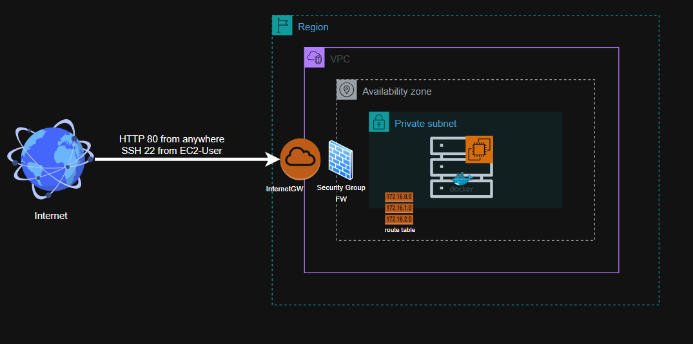

# Terraform AWS Infrastructure Provisioning

This is a learning project that demonstrates Infrastructure as Code (IaC) using Terraform to provision AWS resources. It creates a Virtual Private Cloud (VPC) with a subnet, internet gateway, security group, and an EC2 instance running an Nginx web server via Docker.

## Architecture



The infrastructure includes:
- VPC with DNS support enabled
- Public subnet in a specified availability zone
- Internet Gateway for public internet access
- Default route table configured for internet access
- Security group allowing SSH from your IP and HTTP on port 8080 from anywhere
- EC2 instance with Amazon Linux 2, running Nginx in a Docker container

## Prerequisites

- An AWS account with appropriate permissions
- Terraform installed (version 1.0+ recommended)
- AWS CLI configured with access keys (or use variables)
- SSH key pair for EC2 access
- Your public IP address for security group rules

## Project Structure

```
terraform-learn/
├── main.tf                 # Main Terraform configuration
├── providers.tf            # AWS provider configuration
├── terraform.tfvars        # Variable values (customize these)
├── entry-script.sh         # User data script for EC2 instance
├── .gitignore             # Git ignore rules for Terraform files
└── README.md              # This documentation
```

## Getting Started

1. **Clone or navigate to the project directory**

2. **Configure variables**:
   Edit `terraform.tfvars` with your values:
   ```hcl
   vpc_cidr = "10.0.0.0/16"
   subnet_a_cidr = "10.0.10.0/24"
   avail_zone = "us-east-1a"
   aws_region = "us-east-1"
   env_prefix = "dev"
   my_ip = "YOUR_PUBLIC_IP/32"  # e.g., "203.0.113.1/32"
   access_key = "YOUR_AWS_ACCESS_KEY"
   secret_key = "YOUR_AWS_SECRET_KEY"
   ```

3. **Initialize Terraform**:
   ```bash
   terraform init
   ```

4. **Review the plan**:
   ```bash
   terraform plan
   ```

5. **Apply the configuration**:
   ```bash
   terraform apply
   ```
   Type `yes` when prompted to confirm.

6. **Access your application**:
   After deployment, use the output `ec2-public_ip` to access the Nginx server at `http://<public_ip>:8080`

7. **Clean up resources** (when done learning):
   ```bash
   terraform destroy
   ```

## Variables

| Variable | Description | Default |
|----------|-------------|---------|
| `vpc_cidr` | CIDR block for the VPC | - |
| `subnet_a_cidr` | CIDR block for the subnet | - |
| `avail_zone` | AWS availability zone | - |
| `aws_region` | AWS region for deployment | - |
| `env_prefix` | Environment prefix for resource naming | - |
| `my_ip` | Your public IP for SSH access (with /32) | - |
| `public_key_location` | Path to SSH public key | `~/.ssh/id_rsa.pub` |
| `instance_type` | EC2 instance type | `t2.micro` |
| `access_key` | AWS access key | - |
| `secret_key` | AWS secret key | - |

## Outputs

- `aws-ami_id`: The ID of the Amazon Linux 2 AMI used
- `ec2-public_ip`: Public IP address of the EC2 instance

## Learning Notes

This project demonstrates key Terraform concepts:
- Resource dependencies and references
- Variables and variable files
- Data sources (AMI lookup)
- User data for instance configuration
- Security best practices (least privilege access)
- Tagging for resource organization

## Security Considerations

- The security group allows SSH only from your specified IP
- Port 8080 is open to the world (for demo purposes)
- In production, restrict access further and use private subnets
- Store sensitive variables securely (not in plain text)

## Troubleshooting

- Ensure your AWS credentials have necessary permissions
- Verify your public IP is correctly set in `my_ip`
- Check that the SSH key exists at the specified path
- Use `terraform show` to inspect current state
- View EC2 console logs if instance fails to start properly
